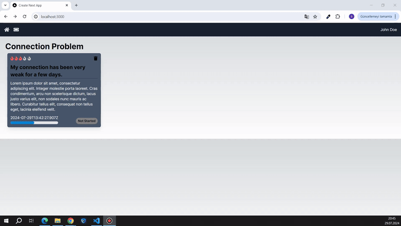

<h1>TICKET HELP</h1>

Ticket Help is an application that allows users to quickly and easily create tickets for Connection, Hardware, and Software issues. Developed with TypeScript, the application is designed using the Next.js framework and MongoDB Atlas database.

<h2> Software Languages </h2>

- HTML

- CSS

- TypeScript

<h2> Libraries </h2>

- React

- Mongoose

<h2> Framework </h2>

- Next JS

- Tailwind CSS

<h2> Database </h2>

- Mongo DB

<h3> Minor Libraries </h3>

- React Icons

<h2> Screen Gif </h2>

